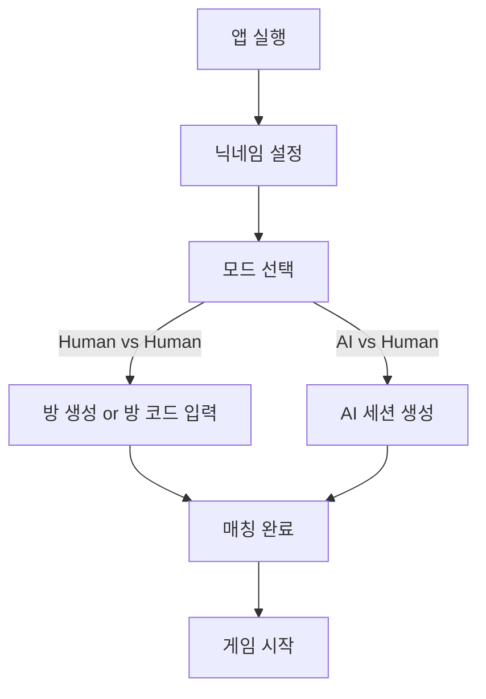
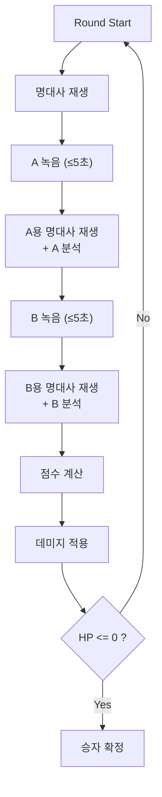
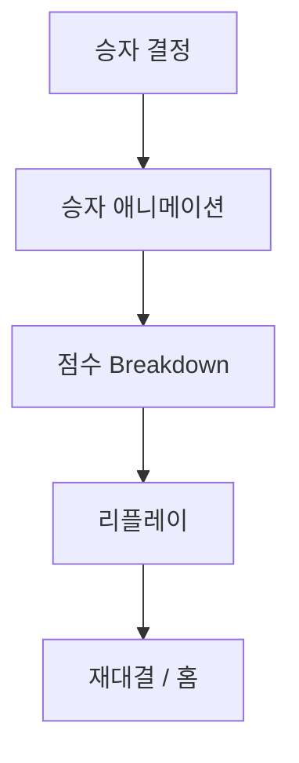

# 📄 PRD: LineFighter

**제품명 (가칭)**: LineFighter
영화 속 명대사를 따라하며 AI 평가 기반으로 대결하는 턴제 음성 배틀 게임

---

## 1. 🎯 제품 목표

### 1.1 목적
- 영화 명대사 모사(imitate) 게임화
- AI 기반 음성 유사도 평가를 활용한 PVP 경쟁
- 짧은 세션(1~3분)으로 강한 몰입감 제공

### 1.2 핵심 가치
- 연기 + 게임성 결합
- 단 한 번의 기회 → 긴장감
- 점수 → HP 감소 → 승패 명확

---

## 2. 👥 타겟 유저
- 10~30대 영화/밈 소비층
- 친구들과 가볍게 대결할 유저
- 스트리밍/공유 콘텐츠 제작자

---

## 3. 🎮 게임 구조

### 3.1 기본 규칙
- HP: 3
- 녹음 기회: 1회 (최대 5초)
- 동점: 불가
- 방 코드 기반 매칭
- 명대사 길이: ≤5초

---

## 4. 🔁 전체 유저 플로우

### 4.1 진입 플로우

### 4.2 인게임 플로우

### 4.3 결과 플로우

---

## 5. 🧠 AI 평가 설계

### 5.1 입력
- Original Audio (≤5초)
- Player Audio (≤5초)

### 5.2 평가 요소

| 항목 | 가중치 |
| --- | --- |
| 톤 유사도 | 0.4 |
| 감정 매치율 | 0.3 |
| 리듬 정확도 | 0.2 |
| 발음 정확도 | 0.1 |

### 5.3 점수 공식
`Final Score = (톤 × 0.4) + (감정 × 0.3) + (리듬 × 0.2) + (발음 × 0.1)`

### 5.4 동점 방지 로직
1. 감정 점수 높은 쪽 승
2. 리듬 점수 비교
3. 소수점 단위 비교

---

## 6. 💥 데미지 시스템

- **HP** = 3
- **Score Difference** = `|P1 - P2|`
- **Damage** = `1 + (Score Difference / 20)`
- **특징**: 최소 1 데미지, 점수 차 클수록 추가 데미지

---

## 7. ⏱ 레이턴시 해결 전략
- A 녹음 직후 A용 명대사 재생 → A 분석 병행
- B 녹음 직후 B용 명대사 재생 → B 분석 병행
- 결과는 BPrompt 종료 시점에 맞춰 표시

> **→ 로딩 화면 없음**  
> **→ 모든 대기시간은 “연출”로 흡수**

---

## 8. 🏗 시스템 아키텍처

- **Client**: 음성 녹음 (5초 제한), 타이머, 애니메이션, 서버 통신
- **Server**: 방 코드 매칭, 세션 관리, HP 계산, 점수 저장
- **AI Engine**: 음성 임베딩 추출, 원본 비교, 점수 계산

---

## 9. 📦 MVP 범위 (해커톤 기준)

**포함**
- AI vs Human
- Human vs Human (방 코드)
- HP 시스템
- AI 점수 계산
- 승자 애니메이션

**제외**
- 랭킹 시스템
- 계정 저장
- 영화 라이선스 관리
- 보이스 필터
- 소셜 공유

---

## 10. 🎯 성공 지표
- 평균 게임 세션 2분 이내
- 한 세션당 최소 2라운드 이상 진행
- 재대결 클릭률 > 40%

---

## 11. 🔮 향후 확장
- 랭크 모드
- 테마 선택 (공포/액션/멜로)
- 배우별 팩
- AI vs AI 관전
- 스트리머 모드

---

## 12. 🚀 MVP 기술 제안
- **음성 분석**: Embedding 기반 cosine similarity
- **감정 분석**: Speech Emotion Model
- **서버**: WebSocket 기반 실시간
- **AI 모델**: Gemini 음성 분석 API or 자체 임베딩
