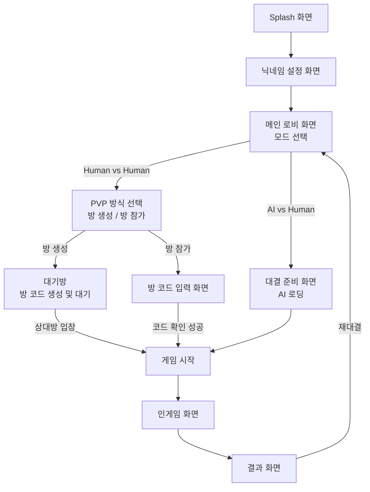
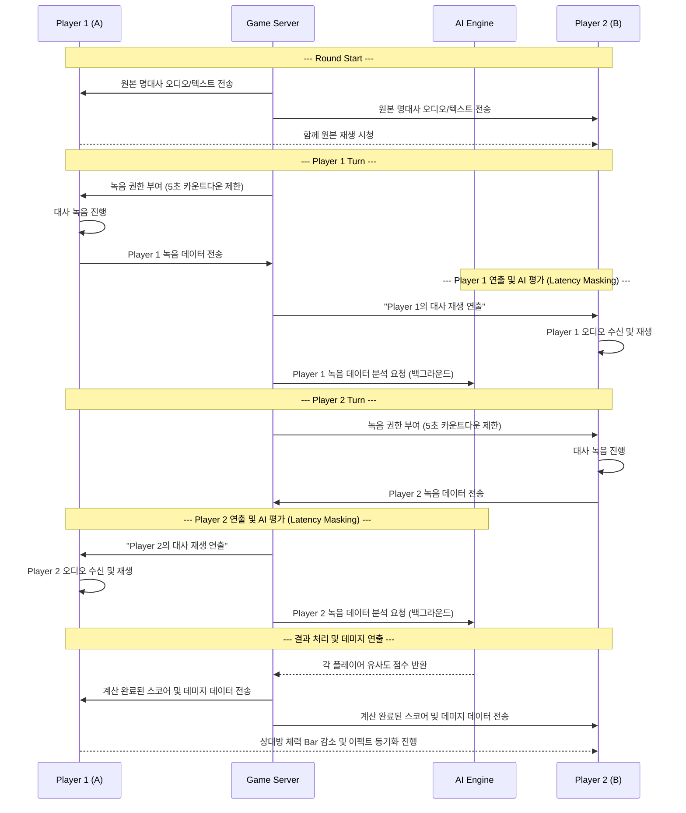

# 🌊 User Flow: LineFighter

이 문서는 LineFighter의 MVP 기준 유저 이동 흐름을 상세하게 정의한 것입니다.

## 1. 전반적인 화면 흐름 (Screen Flow)

---

## 2. 상세 유저 플로우 - 단계별 설명

### 2.1 진입 및 준비 단계 (Onboarding & Lobby)
- **온보딩 과정 최소화**: 복잡한 회원가입이나 로그인 절차를 배제합니다 (MVP 기준 계정 저장 제외).
- **닉네임 설정**: 앱 최초 실행 시 디바이스(로컬 스토리지)에 저장될 닉네임을 입력합니다. 이후 실행 시 단계가 생략되며 즉시 메인 로비로 진입합니다.
- **모드 선택**: "AI와 대결하기" / "친구와 대결하기(방 생성/코드입력)" 등으로 직관적인 버튼 배치를 구성합니다.

### 2.2 멀티플레이어 매칭 (Matchmaking)
- **호스트 측 (방 생성)**
  1. 호스트가 방 생성 버튼 클릭
  2. 서버에서 고유한 방 코드(ex: 4~6자리 문자/숫자) 발급 및 대기 화면 표시
  3. 다른 플레이어가 입장할 때까지 대기 상태 유지
- **참가자 측 (방 접속)**
  1. 방 코드 입력란에 호스트가 공유한 방 코드를 기입 후 입장 버튼 클릭
  2. 코드가 일치하면 서버를 통해 방에 연결되며 즉시 게임 시작 상태로 전환

### 2.3 인게임 상세 플로우 (In-Game Sequence)

단 한 번의 끊김 없는 연출로 진행되며 대기(로딩) 화면 없이 몰입감을 극대화합니다.

**레이턴시 최적화 전략 요약**:
- 플레이어 A가 대사를 녹음한 직후, 플레이어 B의 화면에서 A의 녹음본을 들려주는 연출을 띄우는 동시에 백그라운드에서는 AI가 A의 녹음 데이터를 분석합니다. 
- 결과적으로 체감 로딩 시간이 0에 수렴하게 되어, 매끄러운 턴제 진행이 가능합니다.

### 2.4 결과 및 승패 화면 (Result & Replay)
- **승자 연출**: "Player 2 WIN!" 등 명확한 승패 판정 타이포그래피 및 모션
- **세부 스코어 보드**: 각 플레이어의 항목별 점수(톤, 감정, 리듬, 발음 등) Breakdown을 제공하여 결과에 대한 납득도를 향상
- **재도전 및 이탈 유도**: 
  - 방을 유지한 채 바로 "다시하기" 가능 여부 선택
  - 대결 종료(방 해산) 및 메인 로비(홈)로 돌아가기 기능 제공

---

## 3. 예외 상황 처리 플로우 (Edge Cases)

| 발생 상황 | 프론트엔드/유저 뷰 동작 플로우 |
| :--- | :--- |
| **마이크 권한 거부** | 인게임 진입 혹은 닉네임 설정 전 "마이크 접근 권한이 필요합니다" 모달 노출 → 시스템 권한 설정 창으로 유도 |
| **녹음 시간(5초) 초과** | 5초 타이머 도달 시 강제로 현재까지 녹음된 객체 반환 및 서버로 전송 (녹음 조기 종료 가능) |
| **네트워크 끊김 (이탈)** | "상대방의 연결이 끊어졌습니다." 토스트 바 혹은 중간 결과창 노출 → 방 폭파 및 홈(로비) 화면으로 강제 이동 |
| **잘못된 방 코드 입력** | 코드 입력 시 즉시 판독하여 "유효하지 않거나 만료된 방 코드입니다." 에러 텍스트 피드백 표기 |
| **마이크 입력 볼륨 너무 작음** | 결과 분석 중 "음성이 너무 작아 낮은 점수가 책정될 수 있습니다" 라는 경고 피드백 제공 (디자인 미정) |
